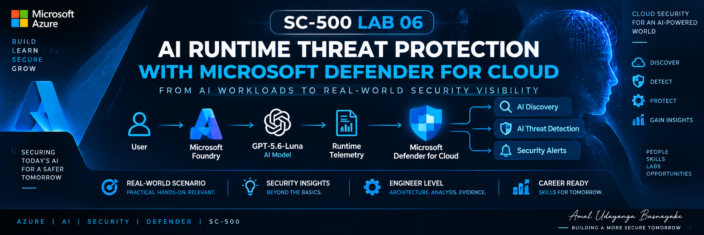
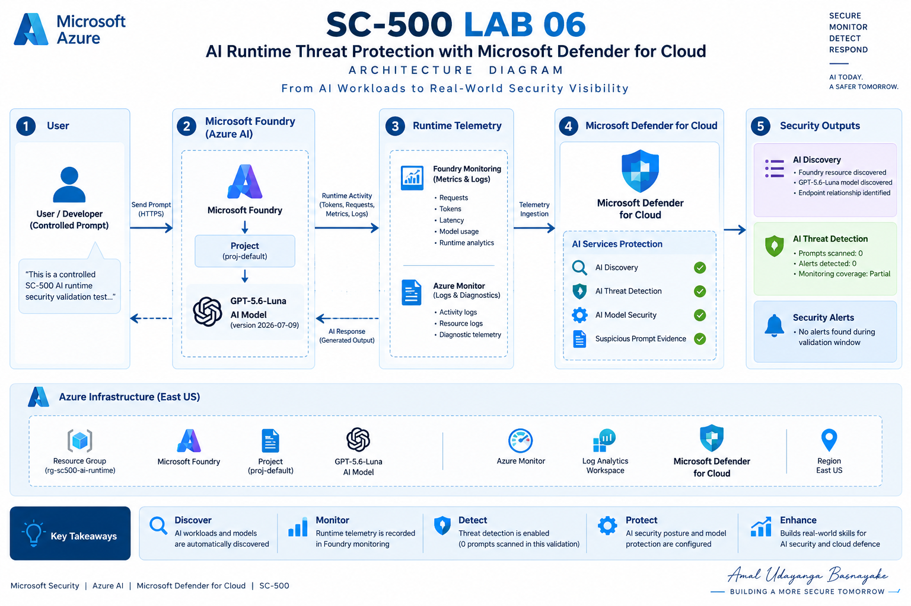

# SC-500 Lab 06 - AI Runtime Threat Protection with Microsoft Defender for Cloud



> ** Cloud & AI Security Lab**
>
> Microsoft Foundry · GPT-5.6-Luna · Microsoft Defender for Cloud · AI Discovery · AI Threat Detection · Runtime Monitoring · Security Validation

[](https://azure.microsoft.com/)
[](https://learn.microsoft.com/azure/defender-for-cloud/)
[](https://learn.microsoft.com/azure/ai-foundry/)
[](https://learn.microsoft.com/credentials/certifications/exams/sc-500/)

---

## 1. Executive Summary

This lab demonstrates an engineer-oriented approach to **AI runtime security validation** using **Microsoft Foundry** and **Microsoft Defender for Cloud**.

The objective was not to manufacture a security alert. Instead, the lab establishes a controlled AI workload, generates a benign runtime interaction, validates runtime telemetry, verifies Defender's AI workload and model discovery capabilities, and then evaluates the resulting AI threat-detection state.

The key engineering finding was:

> **The Microsoft Foundry AI workload and GPT-5.6-Luna endpoint were successfully discovered by Microsoft Defender for Cloud, and runtime activity was confirmed through Foundry monitoring. During the controlled benign validation window, Defender AI Threat Detection reported `0 prompts scanned` and `0 alerts detected`, while AI Services monitoring coverage remained `Partial`.**

This distinction is important: **workload discovery, runtime telemetry, and threat-detection coverage are separate security control layers.**

---

## 2. What This Lab Demonstrates

### Control-plane visibility

- Microsoft Foundry resource discovery
- Microsoft Foundry project discovery
- AI model and endpoint discovery
- Model-to-endpoint relationship visibility
- Defender for Cloud AI security posture visibility

### Data-plane / runtime validation

- GPT-5.6-Luna deployment
- Controlled AI runtime request
- Foundry runtime monitoring
- Request and token telemetry
- Runtime cost visibility

### AI security validation

- Defender for Cloud AI Services plan
- Suspicious prompt evidence configuration
- AI Model Security configuration
- AI workload discovery
- AI model/endpoint discovery
- AI threat-detection dashboard validation
- AI security alert validation
- Monitoring coverage assessment

---

## 3. Architecture

<!-- Add the final architecture image here -->


### Logical security flow

```text
                    ┌─────────────────────────────┐
                    │       User / Tester         │
                    └──────────────┬──────────────┘
                                   │
                                   ▼
                    ┌─────────────────────────────┐
                    │     Microsoft Foundry       │
                    │  foundry-sc500-ai-runtime   │
                    └──────────────┬──────────────┘
                                   │
                                   ▼
                    ┌─────────────────────────────┐
                    │       Foundry Project        │
                    │        proj-default          │
                    └──────────────┬──────────────┘
                                   │
                                   ▼
                    ┌─────────────────────────────┐
                    │       GPT-5.6-Luna          │
                    │       Global Standard        │
                    └──────────────┬──────────────┘
                                   │
                         Controlled Runtime
                             Interaction
                                   │
                    ┌──────────────┴──────────────┐
                    │                             │
                    ▼                             ▼
        ┌─────────────────────┐       ┌─────────────────────────┐
        │ Foundry Monitoring  │       │ Defender for Cloud      │
        │ Runtime Telemetry   │       │ AI Security Controls    │
        └──────────┬──────────┘       └────────────┬────────────┘
                   │                               │
                   │                               ├─ AI Discovery
                   │                               ├─ Model Discovery
                   │                               ├─ AI Threat Detection
                   │                               └─ Security Alerts
                   │
                   ▼
        Requests / Tokens / Cost
```

---

## 4. Lab Environment

| Component | Configuration |
|---|---|
| Cloud | Microsoft Azure |
| Defender plan | Microsoft Defender for Cloud — AI Services |
| AI platform | Microsoft Foundry |
| Region | East US |
| Resource Group | `rg-sc500-ai-runtime-lab` |
| Foundry resource | `foundry-sc500-ai-runtime` |
| Foundry project | `proj-default` |
| Model | `gpt-5.6-luna` |
| Model version | `2026-07-09` |
| Deployment type | Global Standard |
| Environment | Training |
| Purpose | AI Runtime Threat Protection validation |

> **Note:** A separate existing resource, `openai-gcmr-zt-lab`, was not modified as part of this lab.

---

## 5. Security Design

### 5.1 Defender for Cloud — AI Services

The AI Services plan was enabled at subscription level.

Configured controls:

- **Suspicious prompt evidence:** ON
- **Data security for AI interactions:** OFF
- **AI Model Security (Preview):** ON

Data security for AI interactions was intentionally left disabled because it involves Microsoft Purview capabilities and was outside the runtime-threat-protection scope of this lab.

### Evidence


---

## 6. Microsoft Foundry Deployment

The lab created a dedicated Microsoft Foundry resource in **East US** and deployed **GPT-5.6-Luna** using the default deployment configuration.

The model was selected from the available project models and deployed using the **Global Standard deployment** option.

### Evidence


---

## 7. Controlled Runtime Validation

A single controlled benign request was executed against GPT-5.6-Luna:

```text
This is a controlled SC-500 AI runtime security validation test.
Respond with exactly: Runtime security validation successful.
```

Expected response:

```text
Runtime security validation successful.
```

The request completed successfully.

### Security principle

The test intentionally used **benign activity**.

No malicious payload, credential theft attempt, jailbreak, data-exfiltration scenario, or artificial attack was introduced merely to manufacture a Defender alert.

This keeps the lab evidence reproducible and technically honest.

### Evidence


---

## 8. Runtime Monitoring Validation

Foundry Monitor recorded the controlled request.

Observed runtime metrics included:

- Total requests: **1**
- Total token count: approximately **4.35K**
- Input tokens: approximately **4.34K**
- Output tokens: **9**
- Estimated total cost: **$0** at the displayed dashboard precision

This establishes that the AI workload was not merely provisioned — it was actually invoked and generated runtime telemetry.

### Evidence


---

## 9. AI Workload Discovery

Microsoft Defender for Cloud / Cloud Security Explorer successfully discovered the new Microsoft Foundry workload.

Discovered resources included:

```text
foundry-sc500-ai-runtime
foundry-sc500-ai-runtime/proj-default
```

This demonstrates **AI workload inventory and control-plane visibility**.

### Evidence


---

## 10. AI Model & Endpoint Discovery

Cloud Security Explorer identified the GPT-5.6-Luna model and its runtime endpoint relationship.

Observed relationship:

```text
gpt-5.6-luna version 2026-07-09
                │
                │ Runs on
                ▼
          gpt-5.6-luna
```

This is useful from a security engineering perspective because model inventory alone is not sufficient; understanding **which deployed endpoint is running the model** provides additional workload context.

### Evidence


---

## 11. AI Threat Detection Validation

The Defender for Cloud **Data and AI security** dashboard was reviewed after the controlled runtime test.

Observed state:

```text
AI Threat Detection

Prompts scanned:   0
Alerts detected:   0
```

The lab does **not** interpret this as proof that the runtime request was maliciously inspected and found clean.

The correct interpretation is:

> During the controlled validation window, the Defender AI threat-detection dashboard reported zero scanned prompts and zero detected alerts.

This is an observed platform state and therefore becomes a **coverage/validation finding**, rather than an invented detection success.

### Evidence


---

## 12. AI Security Alerts

The AI-specific Security Alerts view was reviewed using the AI/AIServices product component filter.

Observed result:

```text
Open alerts:       0
Active alerts:     0
In progress:       0
Affected resources: 0
No alerts found
```

The subscription filter displayed by the portal may appear as `N/A` due to the portal's filter behavior. The AI/AIServices component filtering and zero-alert result were retained as observed evidence.

### Evidence


---

## 13. Monitoring Coverage Finding

The Defender for Cloud AI Services plan displayed:

```text
AI Services
Status: ON
AI resources: 3
Monitoring coverage: Partial
```

This is an important engineering observation.

**Enabled does not automatically mean fully covered.**

The subscription contains multiple AI resources, and Defender's AI runtime coverage is not represented as full for the entire environment.

The lab therefore treats **Partial** as a coverage finding that should be investigated in a production environment rather than hidden or interpreted as a successful full-coverage state.

### Evidence


---

## 14. Security Findings

### Finding 01 — AI workload discovery is operational

Microsoft Defender for Cloud successfully discovered the dedicated Microsoft Foundry workload and project.

**Status:** Confirmed

---

### Finding 02 — Model and endpoint inventory is operational

Defender Cloud Security Explorer identified the GPT-5.6-Luna model version and its deployed endpoint relationship.

**Status:** Confirmed

---

### Finding 03 — Runtime telemetry is operational

The Foundry deployment successfully processed a controlled request and exposed runtime monitoring metrics.

**Status:** Confirmed

---

### Finding 04 — AI threat-detection dashboard reported zero scanned prompts

After the controlled benign runtime validation, the Defender AI threat-detection dashboard displayed:

```text
Prompts scanned: 0
Alerts detected: 0
```

**Status:** Observed

This should not be converted into a claim that the request was actively threat-scanned and determined safe.

---

### Finding 05 — Subscription AI monitoring coverage remained Partial

The Defender AI Services plan remained enabled with **Partial** monitoring coverage.

**Status:** Observed

---

## 15. Engineering Interpretation

This lab demonstrates an important security architecture principle:

```text
AI Asset Discovery
        ≠
Runtime Telemetry
        ≠
Threat Detection
        ≠
Security Alerting
```

A security engineer should validate these layers independently.

A workload can be:

1. discovered by the security platform,
2. actively processing requests,
3. producing application/runtime telemetry,

while the threat-detection dashboard can still show a different coverage state.

Therefore, **AI security validation must verify both posture and runtime detection coverage.**

---

## 16. Why No Malicious Prompt Was Used

A common mistake in security labs is to create an artificial attack simply because the final screenshot needs an alert.

This lab deliberately avoids that approach.

The purpose was to validate:

- AI workload discovery
- model inventory
- runtime telemetry
- Defender configuration
- threat-detection visibility
- security-alert visibility
- monitoring coverage

No false claim of attack detection is made.

For an advanced follow-up lab, a properly authorized and controlled AI attack simulation can be designed separately with explicit test cases and expected detections.

---

## 17. Cost Awareness

The lab was designed to minimize unnecessary Azure consumption.

The controlled runtime validation used a single request.

Foundry Monitor displayed approximately:

```text
Requests:       1
Tokens:         ~4.35K
Estimated cost: $0
```

The Defender AI Services pricing displayed in the portal was:

```text
$0.0008 / 1K tokens / month
```

Actual billing depends on the applicable Azure pricing and scanned-token consumption.

---

## 18. Evidence Map

| Evidence | Purpose |
|---|---|
| `22-foundry-ai-runtime-resource-created.png` | Foundry resource creation |
| `24-gpt56-luna-model-selection.png` | GPT-5.6-Luna model selection |
| `26-gpt56-luna-default-deployment-settings.png` | Default Global Standard deployment |
| `27-eastus-gpt56-luna-controlled-runtime-test.png` | Controlled runtime execution |
| `28-eastus-gpt56-luna-runtime-monitoring.png` | Runtime telemetry |
| `34-ai-discovery-eastus-foundry-runtime-resource.png` | AI workload discovery |
| `36-eastus-foundry-project-discovery-details.png` | Foundry project discovery |
| `37-ai-model-endpoint-gpt56-luna-discovery.png` | Model/endpoint discovery |
| `38-gpt56-luna-model-runtime-relationship.png` | Model → endpoint relationship |
| `39-data-ai-security-eastus-runtime-final-state.png` | Final AI security dashboard state |
| `32-ai-security-alerts-no-alerts.png` | AI security alert validation |
| `19-ai-services-partial-coverage.png` | AI Services partial coverage |

> Remove any evidence entries whose local filename differs from the final repository filename. Do not create duplicate screenshots for the same portal state.

---

## 19. Recommended Repository Structure

```text
SC-500-Lab-06-AI-Runtime-Threat-Protection-Microsoft-Defender-for-Cloud/
│
├── README.md
├── LICENSE
│
├── Architecture/
│   ├── architecture-diagram.png
│   └── security-workflow.png
│
├── Evidence/
│   ├── 02-ai-services-settings.png
│   ├── 19-ai-services-partial-coverage.png
│   ├── 22-foundry-ai-runtime-resource-created.png
│   ├── 24-gpt56-luna-model-selection.png
│   ├── 26-gpt56-luna-default-deployment-settings.png
│   ├── 27-eastus-gpt56-luna-controlled-runtime-test.png
│   ├── 28-eastus-gpt56-luna-runtime-monitoring.png
│   ├── 32-ai-security-alerts-no-alerts.png
│   ├── 34-ai-discovery-eastus-foundry-runtime-resource.png
│   ├── 36-eastus-foundry-project-discovery-details.png
│   ├── 37-ai-model-endpoint-gpt56-luna-discovery.png
│   ├── 38-gpt56-luna-model-runtime-relationship.png
│   └── 39-data-ai-security-eastus-runtime-final-state.png
│
└── KQL/
    └── README.md
```

---

## 20. Cleanup

After all documentation and GitHub evidence have been finalized, remove only the dedicated lab resource group:

```text
rg-sc500-ai-runtime-lab
```

This lab resource group contains the dedicated:

```text
foundry-sc500-ai-runtime
proj-default
```

Do **not** modify unrelated Azure AI resources.

---

## 21. Final Lab Outcome

### Implementation

**Completed**

### Runtime validation

**Completed**

### AI workload discovery

**Confirmed**

### Model/endpoint discovery

**Confirmed**

### Runtime telemetry

**Confirmed**

### AI threat detection alert

**Not generated during benign validation**

### Defender AI threat-detection dashboard

**0 prompts scanned / 0 alerts detected**

### AI Services monitoring coverage

**Partial**

---

## 22. Final Engineering Takeaway

> **AI security is not only about deploying a model securely. An engineer must establish workload visibility, understand model-to-endpoint relationships, validate runtime telemetry, verify security controls, and independently assess actual threat-detection coverage.**

This lab demonstrates that workflow using Microsoft Foundry and Microsoft Defender for Cloud without manufacturing a security incident.

---

## References

- Microsoft Defender for Cloud — AI threat protection  
  https://learn.microsoft.com/azure/defender-for-cloud/ai-threat-protection

- Microsoft Defender for Cloud — Enable threat protection for AI services  
  https://learn.microsoft.com/azure/defender-for-cloud/ai-onboarding

- Microsoft Defender for Cloud — Discover generative AI workloads  
  https://learn.microsoft.com/azure/defender-for-cloud/identify-ai-workload-model

- Microsoft Foundry documentation  
  https://learn.microsoft.com/azure/ai-foundry/

---

**Author:** Amal Udayanga Basnayake  
**Focus:** Cloud Security · AI Security · Microsoft Defender for Cloud · Microsoft Foundry · SC-500


> **Evidence packaging note:** The README references the final evidence filenames used during the lab. Only files available in the current working directory were copied into this package; the remaining evidence screenshots should be copied from the user's saved evidence set into `Evidence/` using the exact filenames listed above.
